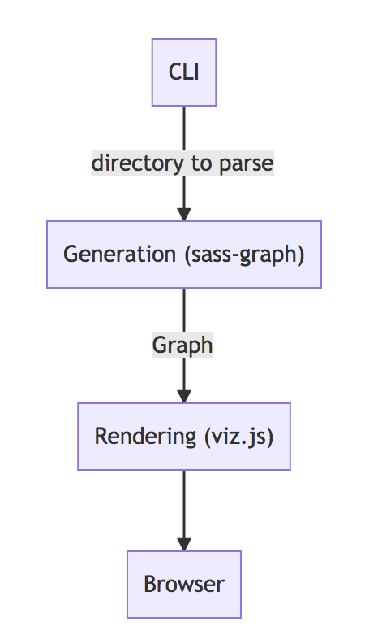

# SASS Graph Viz

Draw a visual graph of SASS dependencies.


## I want to use it…

> You need to install [node.js](https://nodejs.org/).

### As a command line tool

Install it with [npm](https://www.npmjs.com/package/sass-graph): `npm install -g sass-graph-viz`

```shell
$ sassgraphviz --help
Usage: sassgraphviz [options] <target>

Options:
  -e, --exclude-externals  Omit files that are not under given target
  -s, --simple             Generate a simpler visualization (not recommended for complex graphs)
  -p, --port <port>        Port to use [3000]
  -h, --help               Output usage information

Examples:
  sassgraphviz assets/scss
  sassgraphviz .
  sassgraphviz main.scss
  sassgraphviz main.scss -s -e -p 3001
```

You can also use the shorthand `sgv` instead of `sassgraphviz` (e.g. you can type `sgv assets/scss`).

### As a node.js library…

Install it locally to your project: `npm install --save-dev sass-graph-viz`

Then import it in your code:

```js
const sassGraphViz = require("sass-graph-viz");
```

#### To generate a visual graph

```ts
generateVisualGraph( target: string, options?: Options );
```

`target` can be a folder or a file.

`options` are optionals. Values are:

- `excludeExternals: boolean` to omit files that are not under given `target` (default `false`)
- `useSimpleViz: boolean` to generate a simpler visualization (default `false`)
- `port: number` to use a custom port (default `3000`)

For instance:

- `sassGraphViz.generateVisualGraph('path/to/scss/')` to render the default graph
- `sassGraphViz.generateVisualGraph('path/to/scss/', { useSimpleViz: true })` for the simpler visualization
- `sassGraphViz.generateVisualGraph('path/to/scss/', { port: 3001 })` to use port `3001`

## I want to modify the source code…

> You need to install [yarn](https://yarnpkg.com/fr/).

First, clone the repository to get code locally: `git clone git@github.com:nicoespeon/sass-graph-viz.git`

Then, install dependencies: `yarn install` (or simply `yarn`)

Finally, if you do some changes, you need to rebuild the lib to use it: `yarn build` (or `yarn build:watch` for the watch mode).

### And test that nothing has broken

Run tests with `yarn test`.

This project uses [jest](https://jestjs.io/) as a test runner.

### And check the actual behavior of the code

Concrete scenarios are configured in `examples/`.

You can run one with `yarn examples:<name-of-the-example>`. For example:

- `yarn examples:basic-tree` will run the `examples/basic-tree/` scenario
- `yarn examples:simple-viz` will run the `examples/simple-viz/` scenario

You can run all examples with `yarn examples`.

## I want to contribute

:cowboy_hat_face: You're awesome!

Since this is the very beginning of the project, I didn't wrote a `CONTRIBUTING.md` yet. But you can go ahead, fork the repo, do your changes and create a Pull-Request.

I'm here to help. If you have any question, just ask with an issue.

If you don't feel like opening a PR, creating an issue to share some suggestions or report a bug is appreciated.

## I wonder what's new

<details>
<summary>2.0.0</summary>

**[Breaking change]** Second param (`useSimpleViz: boolean`) was replaced by an `options` object:

```ts
generateVisualGraph( target: string, options?: Options )
```

You can generate a simpler visualisation with `useSimpleViz: boolean` option (default `false`).

New features:

- Given target can be a folder, or a file.
  - Provide a file if you want to focus visualization on its ancestors and descendents.
- Configure the port with option `port: number` (default `3000`)
- Exclude omit files which are not under given target folder with option `excludeExternals: boolean` (default `false`).
  - For example, you may not want to visualize bootstrap files dependencies from `node_modules/`

</details>

<details>
<summary>1.0.0</summary>

- First release of the library
- Generate graph with CLI (`sassgraphviz <dir>` or `sgv <dir>`)
- Option to generate a simpler visualization (`sgv --simple <dir>` or `sgv -s <dir>`)
- API method `generateVisualGraph( pathToFolder: string, useSimpleViz = false )`
- Large graphs (more than 30 nodes) display a preloader while computing

</details>

## I want to know who made that

Made with :heart: and :unicorn: by [Nicolas Carlo](https://twitter.com/nicoespeon) under the [MIT](https://choosealicense.com/licenses/mit/) license.

## I have further questions…

<details>
<summary>What's the difference with sass-graph?</summary>

Indeed, there is this awesome lib called [sass-graph][sass-graph] which

> Parses Sass files in a directory and exposes a graph of dependencies.

I found it when I was looking for a lib to generate a graph of sass dependencies for a messy project. Unfortunately, it was only able to output some sort of graph in my terminal, or a json structure. I wanted something visual.

So I decided to **plug sass-graph with a rendering library**: this is the core of sass-graph-viz.

The difference is that sass-graph-viz generates a visual graph of dependencies in your browser.

</details>

<details>
<summary>How is this built?</summary>

It started with [sass-graph][sass-graph] and a rendering library. For the latter, I went with [viz.js](https://github.com/mdaines/viz.js) first because the API was simple and the result looked great.

The core idea is:

1. Expose a CLI command to get the path to the directory I want to parse
2. Delegates to sass-graph the generation of dependencies graph
3. Translate sass-graph's Graph into my `Graph` model
4. Delegates to viz.js the rendering of the `Graph` in the browser



```mermaid
graph TD
  CLI -- directory to parse --> Generation["Generation (sass-graph)"]
  Generation -- Graph --> Rendering["Rendering (viz.js)"]
  Rendering --> Browser
```

Once I got the core idea, I can switch the infrastructure to use any concrete implementation I want, as long as it fulfills the expected interfaces.

> If you're into [Hexagonal Architecture](http://fideloper.com/hexagonal-architecture), it may sounds like ports & adapters. It is, but I didn't made interfaces & the hexagon explicit yet (functions and types are simple enough).

For example, in v1, there are also:

- A node.js API that is consumed in the examples (which are manual E2E tests of the visual result)
- Another rendering solution using [vis](http://visjs.org) (because viz.js was not enough for real-life graphs)

[sass-graph]: https://www.npmjs.com/package/sass-graph

</details>
